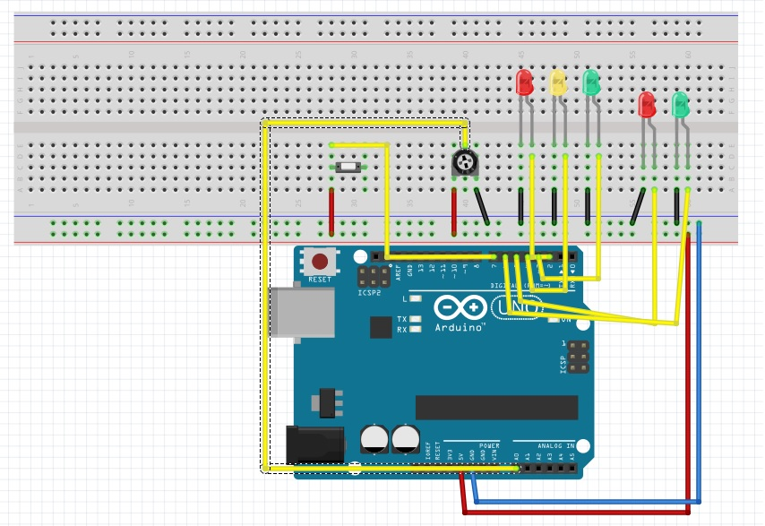
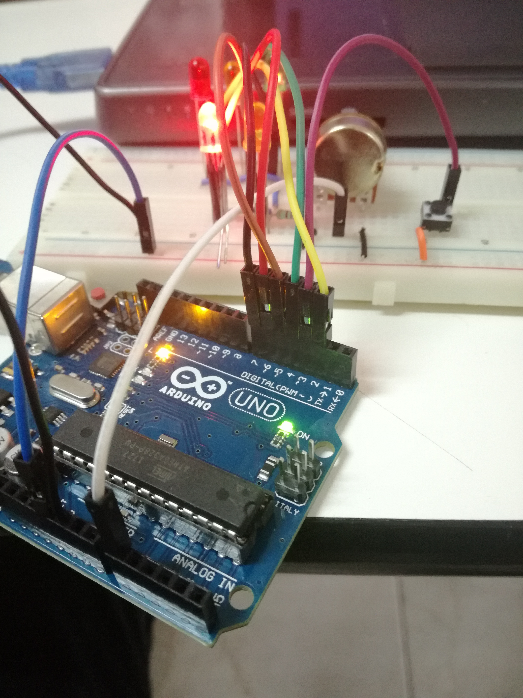
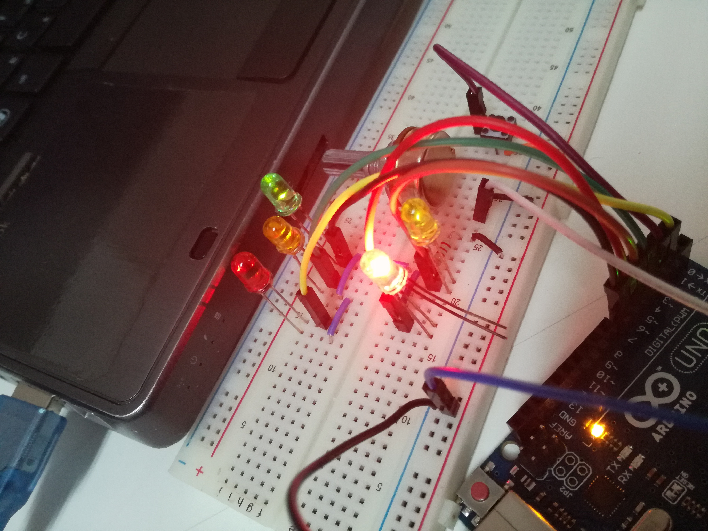

# semaforo con potenciometro
proyecto de arduino para la creacion de un semaforo con paso peatonal

#Indice
* Objetivo
* Descripcion
* Materiales
* Diagrama
* Evidencias
* Codigo
* Conclusion

#Objetivo
>Desarrollar un programa que activa la secuencia de un semaforo al presionar un boton.

#Descripcion
>Se aplicaran conocimientos previos obtenidos en clase para la elaboracion y funcionamiento de un semaforo
>que se activara su secuencia de un semaforo normal con paso peatonal al presionar un boton, no podra reiniciarse 
>el ciclo si se preciona de nuevo el boton hasta que el ciclo alla terminado

#Materiales
*  Protoboard
*  Arduino Uno
*  Cables calibre 22
*  2 led rojo
* 2 led verde
* 1 led amarillo
* 1 boton
* Laptop o PC de escritorio
* Software IDE Arduino

#Diagrama

#Evidencias

#Codigo

     /* 
     Programa que simula la funcion de un semaforo con paso peatonal al presionar un boton, empieza la secuencia y/o inicializa el programa
     en area Mexicana, secuencia verde, amarillo, rojo, verde peatonal y rojo peatonal y donde llevara un potenciometro para hacer el cambio de semaforos mas
     rapido o mas lento dependiendo del valor del potenciometro
     */
    int boton=3;                       // inicializa una variable con el numero de pin del arduino
    int estado = LOW; //inicialiamos el estado en low para que no se active el ciclo al cargar el prgrama

    void setup() // Se ejecuta cada vez que el Arduino se inicia
    {

    //Inicializacion de pines para el semaforo de carros
    pinMode(7,OUTPUT); // Inicializa el pin 7 led verde
    pinMode(4,OUTPUT); // Inicializa el pin 4 led amarillo
    pinMode(2,OUTPUT); // Inicializa el pin 2 led rojo
 
    //inicializacion de los pines para el semaforo peatonal
    pinMode(5,OUTPUT); // Inicializa el pin 5 led verde peatonal
    pinMode(6,OUTPUT); // Inicializa el pin 6 led rojo peatonal
    Serial.begin(9600);

    //inicizlizacion de los pin del boton que iniciara el procezo del comienzo del semaforopeatonal
    pinMode(boton,OUTPUT);//inicializa el boton en pin 3

    //pines en 7,6 en high que corresponde al verde de semaforo de carros y rojo semaforo peatonal
    digitalWrite(7,HIGH);
    digitalWrite(6,HIGH);
    }

    //Función cíclica

    void loop() // Esta función se mantiene ejecutando
    { // cuando esta energizado el Arduino

    //esta condicion funciona para cada que se presione el boton entre al metodo CambioSemaforo 
    //ejecute su funcion solo una vez o hasta que se presione de nuevo el boton en caso de presionar 
    //el boton cuando el ciclo aun no se termina no se reiniciara 
    //hasta que se termine el ciclo
    if(digitalRead(boton))
    CambioSemaforo();
    }

    //metodo donde se ejecuta todo el ciclo de cambio de semaforo
    void CambioSemaforo(){
    //se inicialoz el analogoRead para ver el valor del potenciometro
    // y se imprime
    int valor = analogRead(A0);
    Serial.println(valor);

    //se temporiza el el tiempo de encendido y apagado con el delay 1s=1000ms
    //el proceso de parpadeo de led verde en el semaforo
    digitalWrite(7,HIGH); 
    delay(valor+1000); 
    digitalWrite(7,LOW);
    delay(valor+100); 
  
    digitalWrite(7,HIGH);
    delay(valor+400); 
    digitalWrite(7,LOW);
    delay(valor+100);
  
    digitalWrite(7,HIGH);
    delay(valor+400); 
    digitalWrite(7,LOW);
    delay(valor+100);

    //proceso de encedido y pagado del led amarillo en el semaforo
    digitalWrite(4,HIGH); 
    delay(valor+600); 
    digitalWrite(4,LOW);
    delay(valor+100);

    //se enciende el led rojo del semaforo
    digitalWrite(2,HIGH);
    //y a su vez se apaga el led rojo peatonal
    digitalWrite(6,LOW); 

    //se enciende el red verde peatonal y empieza el proceso de parpadeo 
    digitalWrite(5,HIGH);
    delay(valor+2000); 
    digitalWrite(5,LOW);
    delay(valor+100);
 
    digitalWrite(5,HIGH);
    delay(valor+400); 
    digitalWrite(5,LOW);
    delay(valor+100);
 
    digitalWrite(5,HIGH);
    delay(valor+400); 
    digitalWrite(5,LOW);
    delay(valor+100);

    // se paga el led rojo del semaforo 
    digitalWrite(2,LOW); 
    //a su vez se enciende el led verde del semaforo pin6 y se enciende el led rojo peatonal pin 7
    digitalWrite(6,HIGH);
    digitalWrite(7,HIGH); 
     }
 

#Conclusion
>Me percate que todo ese proceso de la elaboracion del semaforo no es nada complicaco, solo se necesitan conocimientos muy basicos
>y la elaboracion de 4 practicas realizadas en el salon de clases.
